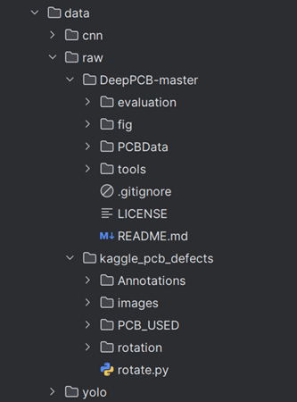

# CAP 5415 Course Project: PCB Defect Detection

## Overview:

This project implements **defect detection in printed circuit boards (PCBs)** using two model families:

- **YOLOv8** (object detection)
- **Custom CNN** (classification)

These instructions were developed by using Python 3.12, which shortened the Python command to the 
acronym of py since I am a Windows User. Activating a Python virtual environment will help prevent affecting
your global Python environment variables. Lastly, make sure your GPU is discoverable by your Python environment. 
## Installation Steps:
1. Download the Python archive file named 5400347-LUIS-VEGA-MAISONET-CourseProject.zip and extract it into your directory of choice. 

2. Open the Python Project with your IDE of choice or with your command line prompt of choice and go 
inside the PCB_Defect_Project folder. Be advised that you need Python 3 installed in your environment to 
be able to run this project.

3. Download the DeepPCB and Kaggle PCB datasets from the following references:
   * S. Tang, F. He, X. Huang, and J. Yang, “DeepPCB: A dataset for PCB defect detection,” GitHub repository, 2019. [Online]. Available: https://github.com/tangsanli5201/DeepPCB/tree/master/PCBData
   * A. Akhatova, “PCB Defects,” Kaggle dataset, 2019. [Online]. Available: https://www.kaggle.com/datasets/akhatova/pcb-defects

4. Unzip both compressed zip files, renamed the "PCB_DATASE" folder inside the unzipped Kaggle folder to "kaggle_pcb_defects", and finally save both unzipped datasets folders inside the course project directory inside data/raw/ in the following manner:



5.  Open your command line of choice and go inside the PCB_Defect_Project directory.

## Execution Steps:
### Instructions for Windows Users (Command Prompt):
1. Inside PCB_Defect_Project directory. Install library dependencies in your environment:
```bash
py -m pip install -r requirements.txt
```
The requirements.txt file should contain the following libraries:
* torch
* torchvision
* ultralytics
* opencv-python
* Pillow
* numpy
* tqdm
* matplotlib
2. Go inside the PCB_Defect_Project/utils directory.
3. Run the data_preparation/prepare_deeppcb.py script to perform training/testing/validation split (70/15/15) on the DeepPCB dataset:
```bash
py data_preparation/prepare_deeppcb.py
```
4. Run the data_preparation/prepare_kaggle_pcb.py script to perform training/testing/validation split (70/15/15) on the Kaggle PCB dataset:
```bash
py data_preparation/prepare_kaggle_pcb.py
```
5. Return to the PCB_Defect_Project directory. Take note that the main script is customizable which means you can run 
YOLOv8 and/or CNN models, and you can specify where to store the CNN and Yolov8 results. Example:
```bash
py main.py --dataset <deeppcb|kaggle_pcb> --model <yolov8|cnn|both> [options...]
```
### Required Arguments:
* --dataset: Its value can be deeppcb or kaggle_pcb. It defines which dataset configuration to use. The paths and class names for each dataset are defined in dataset_configs.py.
* --model: Its value can be yolov8, cnn or both. It defines what pipeline to run: only YOLOv8 detection, only CNN classification, or both in a single call.

### YOLOv8 Optional Arguments:
* --yolo-data: Its value is a string value containing the path from the selected dataset config. Defaults to the data.yaml path of the data/yolo directory.
* --yolo-weights: Its value is a string value containing the pretrained YOLOv8 weights or model name. Defaults to yolov8n.pt.
* --yolo-epochs: Its value is an integer defining the number of epochs for YOLOv8 training. Defaults to 50.	
* --yolo-imgsz: Its value is an integer that defines the image size used by YOLOv8 for training and evaluation (images are resized/padded to this size). Defaults to 640.
* --yolo-project: Its value is a string containing the path to the root directory where YOLOv8 runs are stored (each run will create a subfolder here). Defaults to runs_yolov8.
* --yolo-name: Its value is a string containing the str base name of the YOLOv8 run; the dataset name is automatically appended (e.g., yolov8_pcb_deeppcb). Defaults to yolov8_pcb.
### CNN Optional Arguments:
* --cnn-data-root: Its value is a string containing the root folder for the CNN dataset (with subfolders per class for train/val/test). Defaults to the dataset path defined in dataset_configs.py for the selected --dataset value (AUTO mode).
* --cnn-num-classes: Its value is an integer defining the number of output classes for the CNN. Defaults to the num_classes value defined in dataset_configs.py for the selected dataset (AUTO mode).
* --cnn-batch-size: Its value is an integer defining the batch size used during CNN training. Defaults to 32.
* --cnn-epochs: Its value is an integer defining the number of epochs for CNN training. Defaults to 20.
* --cnn-lr: Its value is a float defining the learning rate used by the CNN optimizer. Defaults to 1e-3 (0.001).
* --cnn-device: Its value is a string defining the device used to train the CNN. It can be "cuda" to force GPU, "cpu" to force CPU, or left unset/None to let PyTorch auto-detect the best device.
* --cnn-checkpoint-dir: Its value is a string containing the directory where CNN checkpoints and training plots (accuracy/loss curves) are stored. Defaults to checkpoints_cnn.
### Results Summary Argument:
* --results-json: Its value is a string containing the path and filename for the JSON summary file where main.py stores the collected metrics for the current run (e.g., YOLOv8 mAP values and CNN accuracies). Defaults to results_summary.json in the project root.
### Commands and parameters used for Course Project (for both the DeepPCB and Kaggle PCB datasets):
```bash
py main.py --dataset deeppcb --model both --cnn-device cuda --cnn-checkpoint-dir checkpoints_cnn_deeppcb --results-json results_deeppcb.json
py main.py --dataset kaggle_pcb --model both --cnn-device cuda --cnn-checkpoint-dir checkpoints_cnn_kaggle --results-json results_kaggle_pcb.json
```
### Instructions for Linux Users (Terminal):
1. Inside PCB_Defect_Project directory. Install library dependencies in your environment:
```bash
python -m pip install -r requirements.txt
```
The requirements.txt file should contain the following libraries:
* torch
* torchvision
* ultralytics
* opencv-python
* Pillow
* numpy
* tqdm
* matplotlib
2. Go inside the PCB_Defect_Project/utils directory.
3. Run the data_preparation/prepare_deeppcb.py script to perform training/testing/validation split (70/15/15) on the DeepPCB dataset:
```bash
python data_preparation/prepare_deeppcb.py
```
4. Run the data_preparation/prepare_kaggle_pcb.py script to perform training/testing/validation split (70/15/15) on the Kaggle PCB dataset:
```bash
python data_preparation/prepare_kaggle_pcb.py
```
5. Return to the PCB_Defect_Project directory. Take note that the main script is customizable which means you can run 
YOLOv8 and/or CNN models, and you can specify where to store the CNN and Yolov8 results. Example:
```bash
python main.py --dataset <deeppcb|kaggle_pcb> --model <yolov8|cnn|both> [options...]
```
### Required Arguments:
* --dataset: Its value can be deeppcb or kaggle_pcb. It defines which dataset configuration to use. The paths and class names for each dataset are defined in dataset_configs.py.
* --model: Its value can be yolov8, cnn or both. It defines what pipeline to run: only YOLOv8 detection, only CNN classification, or both in a single call.

### YOLOv8 Optional Arguments:
* --yolo-data: Its value is a string value containing the path from the selected dataset config. Defaults to the data.yaml path of the data/yolo directory.
* --yolo-weights: Its value is a string value containing the pretrained YOLOv8 weights or model name. Defaults to yolov8n.pt.
* --yolo-epochs: Its value is an integer defining the number of epochs for YOLOv8 training. Defaults to 50.	
* --yolo-imgsz: Its value is an integer that defines the image size used by YOLOv8 for training and evaluation (images are resized/padded to this size). Defaults to 640.
* --yolo-project: Its value is a string containing the path to the root directory where YOLOv8 runs are stored (each run will create a subfolder here). Defaults to runs_yolov8.
* --yolo-name: Its value is a string containing the str base name of the YOLOv8 run; the dataset name is automatically appended (e.g., yolov8_pcb_deeppcb). Defaults to yolov8_pcb.
### CNN Optional Arguments:
* --cnn-data-root: Its value is a string containing the root folder for the CNN dataset (with subfolders per class for train/val/test). Defaults to the dataset path defined in dataset_configs.py for the selected --dataset value (AUTO mode).
* --cnn-num-classes: Its value is an integer defining the number of output classes for the CNN. Defaults to the num_classes value defined in dataset_configs.py for the selected dataset (AUTO mode).
* --cnn-batch-size: Its value is an integer defining the batch size used during CNN training. Defaults to 32.
* --cnn-epochs: Its value is an integer defining the number of epochs for CNN training. Defaults to 20.
* --cnn-lr: Its value is a float defining the learning rate used by the CNN optimizer. Defaults to 1e-3 (0.001).
* --cnn-device: Its value is a string defining the device used to train the CNN. It can be "cuda" to force GPU, "cpu" to force CPU, or left unset/None to let PyTorch auto-detect the best device.
* --cnn-checkpoint-dir: Its value is a string containing the directory where CNN checkpoints and training plots (accuracy/loss curves) are stored. Defaults to checkpoints_cnn.
### Results Summary Argument:
* --results-json: Its value is a string containing the path and filename for the JSON summary file where main.py stores the collected metrics for the current run (e.g., YOLOv8 mAP values and CNN accuracies). Defaults to results_summary.json in the project root.
### Commands and parameters used for Course Project (for both the DeepPCB and Kaggle PCB datasets):
```bash
python main.py --dataset deeppcb --model both --cnn-device cuda --cnn-checkpoint-dir checkpoints_cnn_deeppcb --results-json results_deeppcb.json
python main.py --dataset kaggle_pcb --model both --cnn-device cuda --cnn-checkpoint-dir checkpoints_cnn_kaggle --results-json results_kaggle_pcb.json
```
## Results
* A results_deeppcb.json file should have been generated in the PCB_Defect_Project directory.
* A results_kaggle_pcb.json file should have been generated in the PCB_Defect_Project directory.
* A runs_yolov8 folder should have been created with four subfolders: one training/evaluation run and one evaluation-only run for each dataset (DeepPCB and Kaggle PCB).
* The Yolov8 generated weights should have been generated inside runs_yolov8/weights.
* The checkpoints_cnn_deeppcb and checkpoints_cnn_kaggle folders should have been generated.